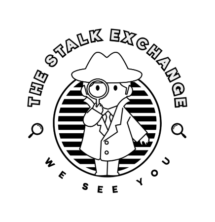

# The Stalk Exchange

Welcome to The Stalk Exchange, your go-to digital detective agency!



## Table of Contents

- [Summary](#summary)
- [Installation](#installation)
- [Implementation](#implentation)
- [Pages](#pages)
- [Credits](#credits)

## Summary

The Stalk Exchange is a unique platform that specializes in turning web stalking into an art form. Our team of digital detectives is dedicated to uncovering secrets, finding lost connections, and solving mysteries. We have an offering of six services that can be customized to your needs.

## Installation

To get started with The Stalk Exchange, simply clone this repository to your local machine.

```
git clone https://github.com/JoMcPherson/internetsleuths
```

## Implementation

Using HTML, CSS stylesheets and custom Tailwind CSS classes, we created an interactive website as a proof of concept. You can navigate between each page using the navigation bar. The navigation is responsive (hidden on smaller screens) with a burger menu icon implemented using Tailwind and JavaScript. The CSS stylesheets includes media queries which change colors based on portrait or landscape view. The elements and pages are responsive to changing screen size with Tailwind classes.

## Pages

### Home Page


### Mobile View


### Sign up Page


### Sign in Page


### Services


### Check Out


### About Us


## Credits
